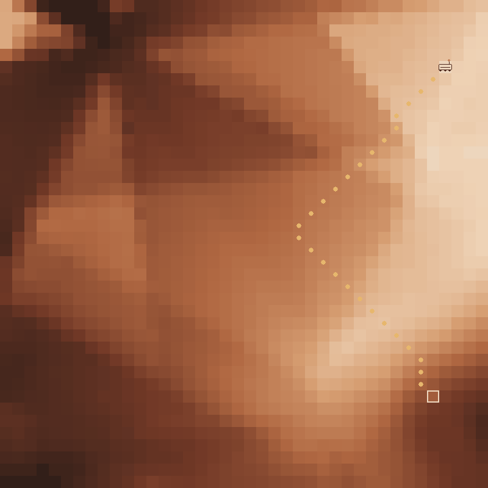
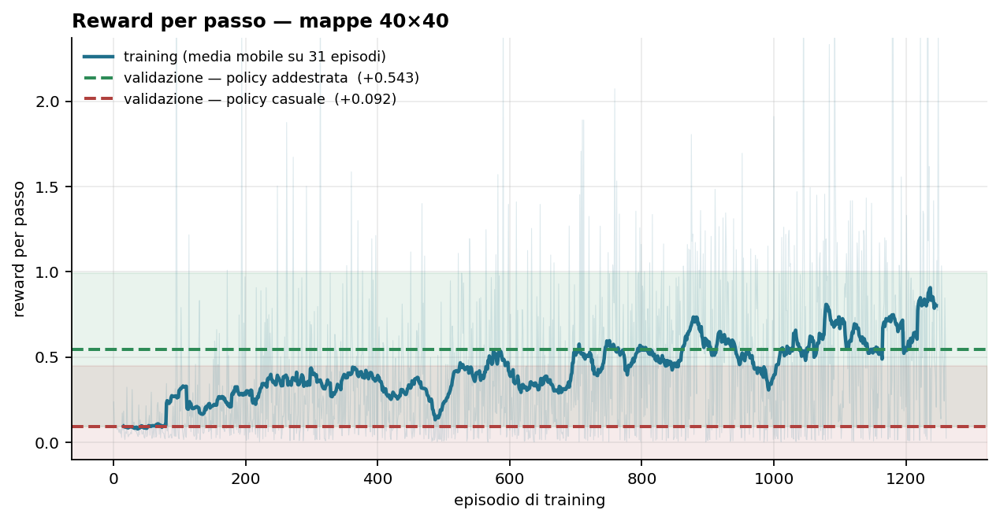
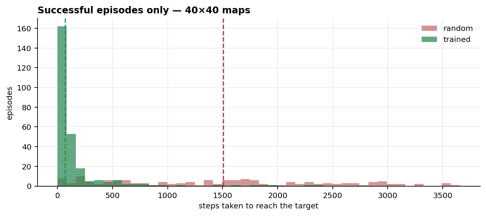

# Rover-Trajectory-Finder

A rover has landed on Mars. It knows its landing point and its destination, but it can only
perceive what is immediately around it. The goal is to reach the target while keeping the path
short.

The terrain comes from real [HiRISE](https://www.uahirise.org/dtm/) digital terrain models,
reduced to a grid where one pixel is one metre. The agent is trained with PPO on an IMPALA
network.



*Blue cells are where the rover has been, amber dots are the shortest path found by Dijkstra,
the red square is the target. The rover only sees its own neighbourhood, not the whole map.*

## Results

On 40×40 maps, evaluated on held-out terrain the agent never trained on (300 episodes each):

| | reached the target | steps per episode | reward per step |
|---|---|---|---|
| random policy | 50.7% | 2643 | +0.092 |
| **trained policy** | **90.0%** | **534** | **+0.543** |



Success rate alone tells half the story. With a budget of 3794 steps on a 40×40 map, a random
walk covers most of the grid and stumbles onto the target half the time. The difference is in
how long it takes: among episodes that do reach the target, the median is **68 steps for the
trained policy against 1506 for the random one**.



> **A note on the metric.** Do not compare policies by *total* episode reward. The reward uses
> potential-based shaping with `gamma = 0.999`, and for `gamma < 1` the undiscounted sum keeps a
> term `(1 - gamma) * sum(distances)` that grows with episode length. A policy that wanders far
> from the target for thousands of steps therefore collects *more* raw reward than one that
> arrives quickly, despite never arriving. The optimal policy is unchanged — that is the point
> of potential-based shaping — but the undiscounted sum is not the objective. Use reward per
> step, success rate and path length instead.

## Setup

```bash
python -m venv .venv
.venv\Scripts\pip install torch --index-url https://download.pytorch.org/whl/cu129
.venv\Scripts\pip install -r requirements.txt
```

The project runs on **Python 3.10**. The first line installs the CUDA build of torch: plain
`pip install torch` on Windows gives the CPU-only one.

## 1. Build the tile pool

The `.IMG` files are never loaded at runtime. `build_tile_pool.py` scans them with windowed
`rasterio` reads, extracts filtered 64×64 tiles and stacks them into a single memory-mapped
`.npy` that every worker process shares.

```bash
python build_tile_pool.py --dtm-dir DTMs/training --out tile_pools/tiles_training.npy --n-tiles 50000
python build_tile_pool.py --dtm-dir DTMs/testing  --out tile_pools/tiles_testing.npy  --n-tiles 4000
```

> **Re-run this whenever you add, remove or replace an `.IMG`.** Training reads the `.npy`, not
> the `DTMs/` folder: if the pool is not rebuilt, new DTMs never enter training and the run
> silently uses the old data without raising anything. It takes about 40 seconds.

This step is required before training or validating.

The practical consequence: the `.IMG` files are a **build-time input, not a runtime dependency**.
To grow the dataset, download a batch of DTMs, fold their tiles into the pool, delete the
`.IMG` files and repeat. Runtime memory depends only on `--n-tiles`, never on how much terrain
was scanned. Loading the DTMs directly instead costs 2.63 GB per worker — 84 GB across 32
workers, all of it the same data.

Useful options:

| flag | default | effect |
|---|---|---|
| `--n-tiles` | 30000 | pool size (50k 64×64 tiles = 819 MB) |
| `--tile-size` | 64 | must cover `map_size + 2*fov_distance`; 64 handles `map_size` up to ~45 |
| `--max-nodata` | 0.0 | largest fraction of nodata pixels a tile may contain |
| `--min-relief` | 0.05 | drop tiles whose altitude standard deviation is below this, in metres |

Tiles are drawn from a non-overlapping lattice with a random offset, with an equal quota per DTM
so that one large raster cannot dominate the pool. `tiles_*_meta.json` records where every tile
came from, so the contents of a training run are reproducible and can be inspected afterwards.

## 2. Train

```bash
python curriculum_learning_training.py
```

The curriculum is the dictionary at the top of the file: one step per entry, each with its
`map_size`, learning rate, loss coefficients, whether to freeze the CNN and which weights to
reload from the previous step. The shipped configuration learns on 20×20 maps and then moves the
same policy to 40×40.

Only the convolutional weights transfer between map sizes: the dense layer has a fixed input
width (3×3×32 = 288 values at 20×20, 5×5×32 = 800 at 40×40), while the trunk that reads terrain
does not care about the map size.

Learning saturates early — around 200k steps at 20×20 — and drifts slightly worse afterwards, so
the step budgets are deliberately modest. Note that `save_interval` overwrites the same files, so
a longer run ends up saving weights that are worse than the ones it already discarded.

`single_training.py` runs a single training without the curriculum.

## 3. Validate

```bash
python validate.py
```

Runs on the testing pool, built from DTMs that never appear in training.

The split is not random. The DTMs were profiled by measuring the fraction of moves the terrain
blocks at `max_step = 0.3`, and one DTM per quartile of the training distribution was moved to
testing: a test set clustered at the median would only measure the typical case, while one
spanning the quartiles has the same difficulty distribution the agent trains on. Result: median
blocked moves **6.5% in training against 6.2% in testing** (previously 10.1% against 59.3%, which
were effectively two different problems).

If you add DTMs and want to redo the split, repeat the profiling — a Mars DTM can range from 1%
to 59% blocked moves with everything else unchanged.

Flags at the top of the script: `SAVE_RESULTS = True` writes one JSON per episode into
`validation_info/`, `False` opens a rendered pygame simulation; `RANDOM_POLICY = True` produces
the random baseline to compare against.

`SAMPLE_ACTION` selects how actions are drawn, and the two settings measure different things:

- **sampled** (default) is the performance of the policy PPO actually optimised, since the
  objective is the expected return of the stochastic policy π(a|s).
- **argmax** is the performance of its greedy projection, which is what you would deploy if you
  wanted deterministic behaviour.

The gap between them is itself a diagnostic. On the trained policy it is large — 60.5% against
92.5% — because the agent is purely reactive: when its preferred move is blocked and the
observation does not change, a deterministic policy has no way of knowing it has already been
there and loops between two cells. Measured over failed argmax episodes: the full step budget
spent visiting about 15 of 400 cells.

Results are analysed in `training_results.ipynb`. `how_things_work.ipynb` explains the
environment, the DTMs and the observation.

## Project layout

| file | role |
|---|---|
| `build_tile_pool.py` | extracts tiles from the DTMs (offline) |
| `tile_pool.py` | serves tiles at runtime, memory-mapped and shared across workers |
| `hirise_dtm.py` | reads `.IMG` files and the terrain geometry (FOV, legal moves, adjacency) |
| `custom_environment.py` | the Gymnasium environment |
| `impala.py` | the IMPALA network (policy + value head); uses GroupNorm, not BatchNorm |
| `agent.py` | PPO: experience collection, training, curriculum, validation |
| `experience_manager.py` | trajectory buffer and GAE |
| `constants.py` | paths and hyperparameters derived from `map_size` |

`DECISIONI.md` records the non-obvious design decisions together with the measurements that
motivated them. Most of them come from bugs that raised no error and only produced a flat
training curve, so they are worth reading before changing anything.

## Observation

6 channels, `(6, map_size, map_size)`. The count lives in `OBSERVATION_CHANNELS` in
`constants.py` and the network reads it from there:

| channel | contents |
|---|---|
| 0 | altitudes relative to the agent, normalised against its traversability limits (±1 is exactly the limit) and clipped at ±3 |
| 1 | validity mask: 1 where the agent has already observed the altitude, 0 elsewhere |
| 2 | current position (1.0) and the trail of previous ones (values rising towards 1) |
| 3 | target position |
| 4 | row offset to the target, normalised, constant over the whole map |
| 5 | column offset to the target, normalised, constant over the whole map |

Channels 4 and 5 look redundant — the agent-to-target vector is already implied by 2 and 3 — but
they are not. In channels 2 and 3 that information is encoded as two single lit pixels in a
20×20 grid, and the convolutional trunk reduces it to 3×3 before the dense layer, by which point
both pixels usually fall in the same cell and their *relative* position is no longer recoverable.
Without channels 4 and 5 the network falls back on the target's **absolute** position, a shortcut
that holds along a straight approach and collapses everywhere else, and training stays flat.
Measured: with 4 channels success goes from 17.9% to 21.1% over 600k steps; with 6 channels, from
38.1% to 82.2%.

The policy is also given an **action mask**: the environment exposes in `info["action_mask"]`
which of the 8 moves are actually traversable, and the others have their probability zeroed
before the choice is made. Without the mask a deterministic policy would pick a blocked
direction, stay in place on an unchanged observation and repeat the same choice forever.

## Terrain difficulty

The lever on difficulty is `max_step_height` and `max_drop_height` in the scripts, not the number
of DTMs: Mars DTMs at 1 m/px are almost all flat relative to a rover that can climb a metre.
Measured on the training pool, 20×20 maps:

| `max_step`/`max_drop` | moves blocked by terrain | map reachable |
|---|---|---|
| 1.0 m | 2.0% | 99.3% |
| 0.5 m | 7.1% | 96.1% |
| **0.3 m** (current value) | **15.1%** | **89.6%** |
| 0.2 m | 24.3% | 79.0% |

At 1 m the problem is "walk to the target across an open field" and an untrained network already
solves about 70% of it: there is nothing to learn.
